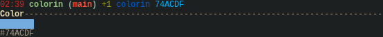
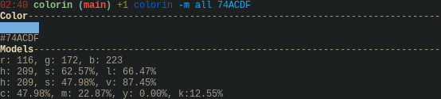
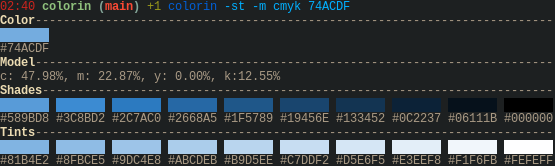

### Colorin

	<a href="../README-en.md">English</a> |
	<a href="README-pt.md">Portugês</a> |
	<a href="README-jp.md">日本語</a>

Convierte RGB en otros modelos (HSL, HSV or CMYK).

[ ! ] Escribí la entrada en hexadecimal.

## Ejemplos

